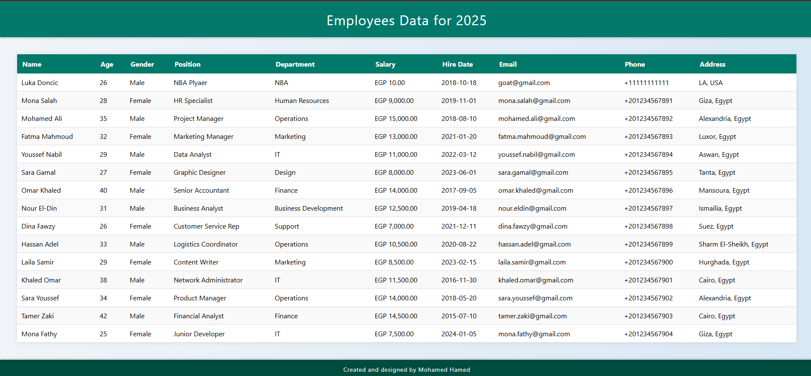

# Docker Compose App

A simple web application that displays employee data using a Flask backend and a MariaDB database, orchestrated with Docker Compose

## Project Structure

```
project/
│
├── app/
│   ├── app.py               
│   ├── requirements.txt     
│   ├── Dockerfile           
│   ├── templates/
│   │   └── index.html       
│   └── static/
│       └── styles.css       
│
├── db/
│   └── init.sql 
│            
├── images/
│   └── output.png             
│
└── docker-compose.yml       
```

## Prerequisites

- Docker
- Docker Compose

## Setup and Running

1. Clone the repository:

   ```bash
   git clone Compose-App
   cd project
   ```

2. Build and start the containers:

   ```bash
   docker-compose up --build
   ```

3. Open your browser and go to:

   ```
   http://localhost:5000
   ```

   You will see the employee data displayed in a styled table

   

## Services

- **db**: MariaDB database initialized with employee data.
- **web**: Flask web application serving the employee data.

## Environment Variables

Defined in `docker-compose.yml` under the `web` service:

- `DB_HOST` — Database host (set to `db` which is the service name)
- `DB_USER` — Database user (`root`)
- `DB_PASSWORD` — Database root password (`123456`)
- `DB_NAME` — Database name (`db`)

## Notes

- The MariaDB container automatically runs the `init.sql` script on first startup to create the database, table, and insert data.
- Flask app connects to MariaDB using the above environment variables.
- Modify `init.sql` to add or change employee data.
